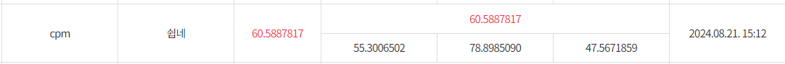

# 2024년 인공지능 한국어 능력 평가 경진 대회 - 일상대화요약(나)
<div align='left'>
  이번 일상대화요약-(나)에 참가한 CPM팀입니다.🎇
</div>

## 1. 데이터셋
현재 국립국어원에서는 train, dev, test 형식으로 데이터셋을 제공해주고 있습니다. (나) 유형은 데이터 증강이 가능하여, 우리는 국립국어원에서 제공한 데이터셋 외에 총 3개의 데이터셋을  추가하였습니다.
* [한국어 글쓰기/이해/문법 데이터셋]([https://kli.korean.go.kr/corpus/main/requestMain.do#](https://huggingface.co/datasets/maywell/LogicKor))
* 한국어 첨삭 데이터셋(자체적으로 수집하고 가공한 데이터셋)
* [Gemma-Magpie](https://huggingface.co/datasets/nayohan/Magpie-Gemma2-Pro-200K-Filtered-ko)

### 1-1. 데이터셋 선정 목적
- 현재 국립국어원에서는 학습과 검증용으로, 608개를 제공하는데, 해당 데이터셋을 통해서 대회의 목표인 주제를 식별하는 능력과 대화 내 각 주제의 핵심 내용을 추출하는 능력을 발휘하는데 부족하다고 판단했습니다.
- 그래서 우리는 일상대화요약에서 중요한 대화 주제 식별과 핵심 내용을 추출하기 위해, 첨삭 데이터셋을 추가하였습니다. 첨삭 데이터를 추가해줌으로써, 대화문에서 핵심 내용을 추출하는 능력과 문장구조 및 어휘 개선 능력을 향상시키는 기여하였습니다.
- 두 번째로, [Magpie](https://github.com/magpie-align/magpie) 방법론을 활용하였습니다. Magpie는 LLM 모델에서 합성 데이터를 생성해주는 방법인데, LLM의 자기회귀적 성질을 활용하여 사전 템플릿만을 주어 다양한 분야의 도메인 데이터를 생성합니다.
  이렇게 수집한 데이터는 SFT+DPO보다 더 높은 성능을 발휘하고 이를 현재 학습된 언어모델에 적용하여, 특정 Task 위주로 학습하면 발생되는 Logit 분포의 불균형을 해소하였고, 언어 모델의 망각현상을 줄이는데 기여하였습니다.

<div align='center'>
  
</div>

### 1-2. 데이터 전처리
- 전처리는 크게 3가지 방법을 사용하였습니다.
  1. 공개적으로 수집한 데이터셋에서 중복을 제거하기 위해 [Simhash](https://github.com/1e0ng/simhash) 을 활용하였습니다.
  2. 미세조정을 수행하기 위해 대화 모델에 맞는 chat_template을 alpaca 형식으로 전처리를 수행하였습니다.
  3. 마지막으로, 한국어 글쓰기/이해/문법 데이터와 첨삭 데이터셋에서 [Knowledge Distilization](https://arxiv.org/pdf/2306.08543)을 활용하여 Sota 모델에서 나온 지식을 소형 모델에 지식을 증류하는 방식으로 데이터 증강을 수행하였습니다.

 ## 2. 모델 선택 개요
 이번 대화 맥락 추론에서 사용된 모델의 종류는 5가지 입니다.
 - [MLP-KTLim/llama-3-Korean-Bllossom-8B](https://huggingface.co/MLP-KTLim/llama-3-Korean-Bllossom-8B)
 - [cpm-ai/Ocelot-Ko-self-instruction-10.8B-v1.0](https://huggingface.co/cpm-ai/Ocelot-Ko-self-instruction-10.8B-v1.0)
 - [THUDM/glm-4-9b-chat](https://huggingface.co/THUDM/glm-4-9b-chat)
 - [Qwen/Qwen2-7B-Instruct](Qwen/Qwen2-7B-Instruct)
 - [google/gemma-2-9b-it](https://huggingface.co/google/gemma-2-9b-it)

   이 중에서 우리는 최첨단 언어 모델인 Gemma2를 채택하였습니다

   ### 2-1. 모델 선택 이유
   - 현재 Gemma2의 경우, 슬라이딩 윈도우 어텐션을 도입하였는데, 이를 통해 계산 비용을 줄이고, 긴 문장을 처리하는데 용이함. 그래서 일상대화와 같이 긴 대화문에 유용하다고 판단하여 모델을 채택하였습니다.
   - 그리고 Gemma2는  Logit Soft Capping을 사용하였는데, 이를 통해 로짓값의 분포를 고르게하여, 안정적인 미세조정을 수행할 수 있어 최종적으로 Gemma2를 채택하게 되었습니다.
  
## 3. 모델링
우리는 [Axolotl](https://github.com/axolotl-ai-cloud/axolotl)을 사용하여 SFT을 수행하였습니다.

### 3.1 모델 학습 전략
- 본 모델의 학습은 QLoRA(Quantized Low-Rank Adaptation) 기법을 활용하여 진행되었습니다. 요약 작업의 특성상, 대화 맥락과는 달리 긴 대화문을 입력받아 그 내용을 요약하는 과정에서 사람마다 요약의 기준이 상이할 수 있습니다.
- 이러한 요약의 다양성을 반영하기 위해, 전체 매개변수 조정보다는 QLoRA를 통해 일부 핵심 매개변수를 효율적으로 조정하는 접근 방식을 채택하였습니다. 이를 통해 모델의 성능을 최적화하면서도 유연성을 유지할 수 있었습니다.

<details>
<summary>HyperParameter</summary>
  
- 'QLORA' 
  - `lora_r`: 64
  - `lora_alpha`: 64
  - `lora_dropout`: 0.05
  - 'lora_target_linear': true
  - 'load_in_4bit': true
  - `torch_dtype`: bfloat16
  - `seed`: 42
  - `epoch`: 5
  - `micro_batch_size`: 4
  - `weight_decay`: 0.05
  - 'weight_ratio' : 0.1
  - `lr_scheduler_type`: "cosine"
  - `warmup_steps`: 20
  - 'learning_rate': 2e-5
  - 'optimizer' : 'adamw_bnb_8bit'
  - `gradient_accumulation_steps`: 4
  - `gradient_checkpointing`: True
  - `max_seq_length`: 8192
</details>

## 4. 학습 및 평가결과
<div align='center'>
  
</div>
<div align='center'>
  
</div>

## 5. 모델 사용 방법
```python
import torch
from transformers import AutoTokenizer, AutoModelForCausalLM, TextStreamer

BASE_MODEL = "cpm-ai/Gemma2-Malpyung-DailyConversationSummary-NA"
model = AutoModelForCausalLM.from_pretrained(BASE_MODEL,torch_dtype=torch.float16, device_map={"":0},)
tokenizer = AutoTokenizer.from_pretrained(BASE_MODEL)
streamer = TextStreamer(tokenizer)

chat = [
    { "role": "user", "content": """[Conversation]
화자SD2000268: 아까 누나가 한 명 있다고 하셨는데
화자SD2000268: 누나랑 어~ 관계가 어떠한지 좀 구체적으로 네. 궁금하네요.
화자SD2000266: 다들 알던 것처럼 어렸을 때는 되게 많이 싸웠고
화자SD2000266: 많이 싸우면서 진짜 그냥 길 지나가더라도 모른 척하고 에~ 집에 들어와서 어~ 아까 봤는데 어디 가냐라고 오히려 얘기하면서 그렇게 많이 친하진 않았었거든요.
화자SD2000266: 그런데 대학교를 다니면서 누나가 현실적으로는 용돈을 진짜 적게 받고 있다는 되게 되게 들었거든요. 되게 열심히 살고 대학을 다녔구나 그리고 드 그 등록금도 다 마련을 하면서 살았구나라는 생각이 뒤에 들면서 쪼금 생각도 조금 달라졌고 그러다 보니깐 이제 성인이 돼서 오히려 누나를 조금 더 챙기게 되는 거 같고 예전에는 솔직히 연락을 많이 안 했었거든요. 근데 누나가 결혼하고 나서는 오히려 제가 뭐 생활에 도움되는 것들 아니면 그런 정부의 지침들 이런 거를 보면 쪼금 더 연락을 많이 하고 연락을 아~ 연락을 많이 하고 지내는 거 같고
화자SD2000266: 그리고 이제 누나 때문에 더 매형한테도 연락을 많이 하게 되는 거 같은데 우리 지 집에 두 명이 오더라도 누나는 진짜 자기 집이기 땜에 편하지만 매형은 그렇지 않다라고 생각을 하고 근데 그 시선이 동생한테마저도 느껴지면 조금 결혼 부부지만 또 불편한 뭐 친가나 이렇게 될 수 있기 때문에 외가가 될 수도 있기 때문에 어떻게든 연락을 많이 하려고 노력안을 하는 거 같아요.
화자SD2000266: 그러면 잔 그~ 자매가 있다라고 했는데 시간이 지나가면서 그런 모임 같은 것도 하고 계시나요?
화자SD2000268: 네. 저도 어~ 밑에 여동생이 둘이고 이제 나이 터울도 밑에 동생은 세 살이 나고 바로 또 막내 동생이랑은 열 살이 차이가 나거든요. 그래서 실은 제가 스무 살 때 학교를 타 지역으로 가서 특히나 막내 동생이랑은 뭐 교류가 별로 없었고 나이도 어리고 그리고 저도 인제
화자SD2000268: 실은 결혼하고도 애를 낳기 전까지 그렇게 뭐 자주 만나진 않았던 거 같아요. 제가 계속 부산에 살았었고 본가는 대구에 있고 이래서 뭐 한 번씩 집에 오긴 오지만 뭐 그렇게 대단히 막 그렇게 친하게 지내지는않았던 거 같은데 저희 이제 애가 태어나고 난 뒤로 더 급속히 이제 관계가 많이 좋아졌고 음 동생들이 정말 제가 봐도 자기가 낳은 자녀가 아닌데도 많이 사랑해주는 모습 그리고 정말 물심양면으로 서포트해주는 모습을 보면서 어~ 동생들에게 정말 감사하고 있고 그래서 그렇게 되면서 정말 자주 만나거든요. 저희가 대구로 이사온 뒤로는
화자SD2000268: 동생 동생 막내 동생은 서울에서 직장 생활을 하고 바로 밑에 동생은 또 군위에서 결혼 생활하면서 또 일을 하고 있는데도 불구하고 어~ 자주 만나고 또 자주 이렇게 이야기도 나누지만 또 같은 여자이기 때문에 또 할 수 있는 이야기들도 많이 나누고 또 뭐가 필요하면 여자들 같은 경우는 그렇잖아요. 이렇게 화장품이 필요하면 같이 이제 막 홈쇼핑에서 공구를 해서 이제 막 그렇게 해서 나눠쓴다거나 그래서 아이들을 낳은 뒤로 관계가 더 많이 좋아진 것 같아요. 네.
화자SD2000268: 어~ 혹시 어렸을 때 누나가 아니라 뭐 형이나 동생이 있기를 바랐던 적은 없었는지 듣고 싶네요.
화자SD2000266: 형이 있으면 있었으면 좋았을 때는 딱 두 번인데 쪼금 불의를 당했거나 아니면 이제 또 학교에 뭐 일명 일찐이든지 뭐 싸움 잘하는 애든지 시비가 걸리든지
화자SD2000266: 이랬을 때 형이 있었으면 쪼금 더 깔끔하게 그 이후에 뭐 피를 보지 않게 했지 않을까라는 생각도 들었고
화자SD2000266: 그리고 유독 형 있는 친구들이 옷을 잘 입었었거든요. 그러니까 형의 옷을 입고 아니게 되면 그게 자연스럽게 변화가 오는데 보통 내 제가 살 옷의 두 배가 되기 때문에 그럴 때 조금 형이 있었으면 좋지 않을까 라는 생각을 했었고 동생이 있었으면 하는 적은 없었는 거 같아요.
화자SD2000266: 왜냐면 제가 조금 현실적인 그런 조금 이성적인 게 조금 강해서 제가 동생이 있었으면 조금 잔소리를 많이 했었을 거 같지 한나라는 생각이 들어서 아무래도 인생을 몇 년 더 살다 보니까 더 빨리 알았으면 더 미리 알았으면 좋았던 것들이 보이는데 그게 동생한테 이롭게 하기 위해서 먼저 해봐 해보든지 뭐 경험해 모 보든지라고 할 순 있지만 또 동생 입장에서는 자기가 하고 싶은 게 있을 거고 자기가 바라는 게 있을 건데 단지 먼저 해본 형의 경험을 기준으로 얘기하면 그 동생은 오히려 스트레스를 많이 받지 않았을까 라는 생각이 들면서 동생 있었으면 좋겠다는 생각을 잘 안 해본 거 같습니다.
화자SD2000266: 남동생 있었으면 라는 생각 해보신 적이 없나요?
화자SD2000268: 그런 질문을 받아본 것도 처음인데 생각을 한번도 해본 적이 없는 거 같아요. 남동생 이 있으면 오히려 불편했을 거 같은 생각이 지금 막 머리를 스쳐 지나가고
화자SD2000268: 집에서 딸이 셋이다 보니까 10대 때부터 아빠가 한번씩 외로워보인다는 생각은 종종 했었거든요. 목욕탕에 같이 갈 아들도 없고 뭔가 등을 밀어줄 아들도 없고 그런 부분에서는 남동생이 있었으면 좋겠다는 생각은 안 했고 아 내가 아들이었으면 아빠랑 목욕탕을 같이 갈 수 있었을 텐데 이렇게 생각을 했었던 적은 몇 번 네. 기억이 있는 거 같아요. 내 여동생들이 너무 좋아서 남동생이 있었으면 좋겠다는 생각은 한 번도 해본 적이 없는 거 같네요. 지금 보니까 부모님에게서 가장 어~
화자SD2000268: 부모님을 보면서 가장 닮고 싶은 부분이 혹시 있을까요?
화자SD2000266: 뭐 그~ 닮고 싶은 점 중에서 성실함을 제일 배우고 싶은데
화자SD2000266: 어렸을 때부터 이제 직장일을 하다 보니까 어렸을 때부터 돈을 벌어서 자녀들한테 이래 베풀면서 맛있는 거 사주며 사는 게 현실적으로 쉬운 게 아니었구나.
화자SD2000266: 그냥 집에 퇴근하는 들어온 길에 뭐라도 사서 들어오 그~ 사 가져와주시는 게 되게 쉽지 않구나라고 생각이 많이 들기 때문에 그럼에도 근무를 하셨 계속 일을 해오셨고 이제 퇴직을 앞두시고 계신데 앞으로도 어떻게 먹고 살지를 더 또 생각을 하시는 걸 보니까 그런 성실함이 좀 배우고 싶다는 생각이 들었습니다.

[Question]
위 누나, 자매, 형, 남동생, 부모님 주제에 대한 대화를 요약해주세요.""" },
]

prompt = tokenizer.apply_chat_template(chat, tokenize=False, add_generation_prompt=True)
inputs = tokenizer.encode(prompt, add_special_tokens=False, return_tensors="pt")
outputs = model.generate(input_ids=inputs.to(model.device), 
                         max_new_tokens=1024,
                         do_sample=False,
                         streamer=streamer
                        )
```

## 6. 추후 연구 계획
- 추후 연구 계획으로, 기존 gemma2도 MergeKit 방식을 사용하였는데, 일상대화요약의 평가 점수인 Rouse, Bertscore, Bleurt에서 각 모델별로 높은 성능을 발휘했던 모델들을 MergeKit 사용하여 가중치를 합치는 방식으로 좀 더 높은 성능을 도출하도록 연구를 진행 할 예정입니다.
<div align='center'>
  
</div>
